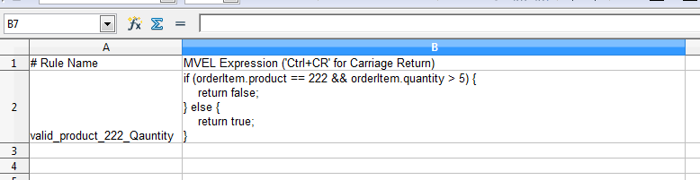

= Smooks Rules Cartridge

image:https://img.shields.io/maven-central/v/org.smooks.cartridges/smooks-rules-cartridge[Maven Central]
image:https://img.shields.io/nexus/s/org.smooks.cartridges/smooks-rules-cartridge?server=https%3A%2F%2Foss.sonatype.org[Sonatype Nexus (Snapshots)]
image:https://github.com/smooks/smooks-rules-cartridge/workflows/CI/badge.svg[Build Status]

// tag::smooks-rules-cartridge[]
Rules in Smooks refer to a general concept and is not specific to any cartridge. A RuleProvider can be configured and referenced from other components. As of Smooks v1.2, the only Cartridge using Rules functionality is the https://github.com/smooks/smooks-validation-cartridge/blob/master/README.adoc[Validation Cartridge].

So, lets start by looking at what rules in Smooks are, and how they are used.

== Rule Configuration

Rules are centrally defined through `+ruleBase+` definitions. A single Smooks config can reference many `+ruleBase+` definitions. A `+rulesBase+` configuration consists of a `+name+`, a rule `+src+`, and a rule `+provider+`. The format of the rule source is entirely dependent on the provider implementation. The only requirement is that the individual rules be named (unique within the context of a single source) so as they can be referenced by their name.

An example of a `+ruleBase+` configuration is as follows:

.smooks-config.xml
[source,xml]
----
<?xml version="1.0"?>
<smooks-resource-list xmlns="https://www.smooks.org/xsd/smooks-2.0.xsd"
                      xmlns:rules="https://www.smooks.org/xsd/smooks/rules-1.1.xsd">

    <rules:ruleBases>
        <rules:ruleBase name="regexAddressing" src="/org/smooks/validation/address.properties"
                        provider="org.smooks.rules.regex.RegexProvider" />
        <rules:ruleBase name="order" src="/org/smooks/validation/order/rules/order-rules.csv"
                        provider="org.smooks.rules.mvel.MVELProvider"/>
    </rules:ruleBases>

</smooks-resource-list>
----

=== Rule Base Configuration Options

The following are the configuration options for the configuration element.

* `+name+`: Is used to reference this rule from other components, like from a validation configuration that we will look at shortly. Required.
* `+src+`: Is a file or anything meaningful to the RuleProvider. This could be a file containing rules for example. Required.
* `+provider+`: Is the actual provider implementation that you want to use. This is where the different technologies come into play. In the above configuration we have one RuleProvider that uses regular expression. As you might have guessed you can specify multiple ruleBase element and have as many RuleProviders you need. Required.

== RuleProvider Implementations

Rule Providers implement the `+org.smooks.rules.RuleProvider+` interface.

Smooks v1.2 supports 2 RuleProvider implementations out-of-the-box:

. link:#regexprovider[RegexProvider]
. link:#mvelprovider[MVELProvider]

You can easily create custom RuleProvider implementations. Future versions of Smooks will probably include support for e.g. a Drools RuleProvider.

=== RegexProvider

As it's name suggests, the RegexProvider is based on regular expression.It allows you to define low level rules specific to the format of specific fields of data in the message being filtered e.g. that a particular field is a valid email address.

Configuration of a Regex `+ruleBase+` would look like this:

.smooks-config.xml
[source,xml]
----
<?xml version="1.0"?>
<smooks-resource-list xmlns="https://www.smooks.org/xsd/smooks-2.0.xsd"
                      xmlns:rules="https://www.smooks.org/xsd/smooks/rules-1.1.xsd">

    <rules:ruleBases>
        <rules:ruleBase name="customer" src="/org/smooks/validation/order/rules/customer.properties"
                        provider="org.smooks.rules.regex.RegexProvider"/>
    </rules:ruleBases>

</smooks-resource-list>
----

Regex expressions are defined in standard _.properties_ file format. An example of a _customer.properties_ Regex rule definition file (from the above example) might be as follows:

.customer.properties
[source,properties]
----
# Customer data rules...
customerId=[A-Z][0-9]{5}
customerName=[A-Z][a-z]*, [A-Z][a-z]
----

==== Useful Regular Expressions

The following is a list of "useful" regular expressions that we hope to grow over time as a resource for people use Regex Rules.

See the http://regexlib.com/[Regular Expression Library].

[source,properties]
----
# Email Address Validation
email=^((?>[a-zA-Z\d!#$%&'*+\-/=?^_`{|}~]+\x20*|"((?=[\x01-\x7f])[^"\\]|\\[\x01-\x7f])*"\x20*)*(?<angle><))?((?!\.)(?>\.?[a-zA-Z\d!#$%&'*+\-/=?^_`{|}~]+)+|"((?=[\x01-\x7f])[^"\\]|\\[\x01-\x7f])*")@(((?!-)[a-zA-Z\d\-]+(?<!-)\.)+[a-zA-Z]{2,}|\[(((?(?<!\[)\.)(25[0-5]|2[0-4]\d|[01]?\d?\d)){4}|[a-zA-Z\d\-]*[a-zA-Z\d]:((?=[\x01-\x7f])[^\\\[\]]|\\[\x01-\x7f])+)\])(?(angle)>)$

# Matches a negative or positive percentage between 0 and 100 (inclusive). Accepts up to 2 decimal places.
percentage.withdecimal=^-?[0-9]{0,2}(\.[0-9]{1,2})?$|^-?(100)(\.[0]{1,2})?$

# HTTP/HTTPS Url
url.http=^(http|https)\://[a-zA-Z0-9\-\.]+\.[a-zA-Z]{2,3}(:[a-zA-Z0-9]*)?/?([a-zA-Z0-9\-\._\?\,\'/\\\+&amp;%\$#\=~])*$
----

=== MVELProvider

The http://mvel.documentnode.com/[MVEL] Provider allows rules to be defined as MVEL expressions. These expressions are executed on the contents of the Smooks Javabean bean context. That means they require Data to be bound (from the message being filtered) into Java objects in the Smooks bean context. This allows you to define more complex (higher level) rules on message fragments, such as "is the product in the targeted order item fragment within the age eligibility constraints of the customer specified in the order header details".

NOTE: Be sure to read the section on https://github.com/smooks/smooks-javabean-cartridge/blob/master/README.adoc#java-binding[Java Binding].

Configuration of an MVEL `+ruleBase+` would look like this:

.smooks-config.xml
[source,xml]
----
<?xml version="1.0"?>
<smooks-resource-list xmlns="https://www.smooks.org/xsd/smooks-2.0.xsd"
                      xmlns:rules="https://www.smooks.org/xsd/smooks/rules-1.1.xsd">

    <rules:ruleBases>
        <rules:ruleBase name="order" src="/org/smooks/validation/order/rules/order-rules.csv" provider="org.smooks.rules.mvel.MVELProvider"/>
    </rules:ruleBases>

</smooks-resource-list>
----

MVEL rules must be defined as Comma Separated Value (CSV) files. The easiest way to edit these files is through a Spreadsheet Application (e.g. OpenOffice or Excel). Each rule record contains 2 fields:

. A Rule Name
. An MVEL Expression

Comment/header rows can be added by prefixing the first field with a hash ('#') character.

An example of an MVEL rule CSV file as seen in OpenOffice is as follows:

== Maven Coordinates

.pom.xml
[source,xml]
----
<dependency>
    <groupId>org.smooks.cartridges</groupId>
    <artifactId>smooks-rules-cartridge</artifactId>
    <version>2.0.0-M3</version>
</dependency>
----
// tag::smooks-rules-cartridge[]

== License

Smooks Rules Cartridge is open source and licensed under the terms of the Apache License Version 2.0, or the GNU Lesser General Public License version 3.0 or later. You may use Smooks Rules Cartridge according to either of these licenses as is most appropriate for your project.

`+SPDX-License-Identifier: Apache-2.0 OR LGPL-3.0-or-later+`